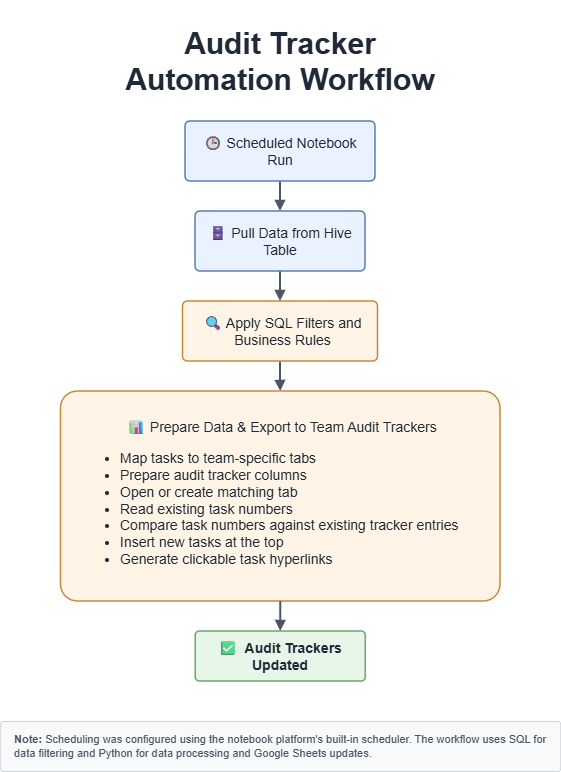

# Audit Tracker Workflow Automation

> A non-confidential engineering case study demonstrating how Python, SQL, and Google Sheets automation replaced a repetitive manual audit preparation process.

---

## Overview

This repository documents a production workflow automation I designed to eliminate the manual preparation of team audit trackers.

The production solution was implemented as a scheduled Python notebook that retrieved operational data from Hive, applied SQL-based business rules, prepared structured audit tracker data, prevented duplicate entries, and automatically updated team-specific Google Sheets audit trackers.

This repository focuses on the engineering approach, workflow design, and technical decisions behind the automation without exposing proprietary source code, internal system names, confidential data, or business logic.

---

## Business Problem

Preparing audit trackers was a recurring manual process performed before the team could begin its review work.

The workflow required:

- retrieving operational task data
- applying business filtering rules
- determining the responsible team
- preparing the required audit tracker columns
- creating clickable task hyperlinks
- checking whether tasks already existed in each tracker
- copying only new tasks into the correct team tab

This process was repetitive, time-consuming, and introduced several operational risks:

- manual copy-and-paste errors
- inconsistent application of business rules
- duplicate tracker entries
- missed eligible tasks
- audit trackers not being ready when the team started work

---

## Solution

A scheduled Python notebook automated the complete audit tracker preparation workflow.

The automation:

- retrieved operational task data from Hive
- applied SQL-based business rules
- prepared data in the required audit tracker format
- mapped each task to its corresponding team tracker
- opened existing tracker tabs or created new ones when required
- generated clickable task hyperlinks
- compared task numbers against existing tracker entries
- inserted only new tasks at the top of each tracker
- generated a processing summary after every execution

The notebook scheduling was provided by the platform's built-in scheduler.

---

## Workflow Architecture

> **Note**
>
> Scheduling was configured using the notebook platform's built-in scheduler.
> SQL handled data retrieval and business rule filtering, while Python handled data preparation, deduplication, and Google Sheets updates.

---

## Technology Stack

- Python
- Pandas
- SQL
- Apache Hive
- Google Sheets API
- Scheduled Notebook Environment

---

## Key Engineering Features

### Automated Team Routing

Tasks are automatically mapped to the correct audit tracker based on the responsible team.

### Structured Data Preparation

The workflow transforms operational task records into the predefined structure required by the audit trackers, including hyperlink generation and column formatting.

### Duplicate Prevention

Existing task numbers are read directly from each tracker before new records are processed.

Only tasks that are not already present are inserted, allowing the workflow to be safely executed multiple times.

### Automated Google Sheets Updates

The workflow updates the appropriate team tracker, creates missing tabs when necessary, inserts new rows at the top, and preserves existing audit history.

### Processing Summary

Each execution produces a summary describing the processing results, providing operational visibility after every scheduled run.

---

## Quality & Reliability

The workflow was designed to provide consistent, repeatable results.

Key controls include:

- SQL-based business rule filtering
- stable task-number comparisons
- team-specific routing
- predefined audit tracker schema
- automatic duplicate prevention
- repeatable scheduled execution
- execution summary reporting

---

## Results

The automation:

- eliminated manual audit tracker preparation
- removed repetitive copy-and-paste work
- reduced opportunities for human error
- ensured consistent application of business rules
- prevented duplicate tracker entries
- ensured audit trackers were prepared before daily review activities

---

## Confidentiality

This repository is a non-confidential engineering case study.

No proprietary source code, internal system names, credentials, business data, or confidential business rules are included.

Any future implementation examples will use fictional data and simplified logic created specifically for demonstration purposes.

---

## Repository Roadmap

Future additions include:

- Detailed engineering case study
- Workflow design decisions
- Testing strategy
- Simplified public implementation
- Fictional sample data
- Unit tests
- Example execution outputs
