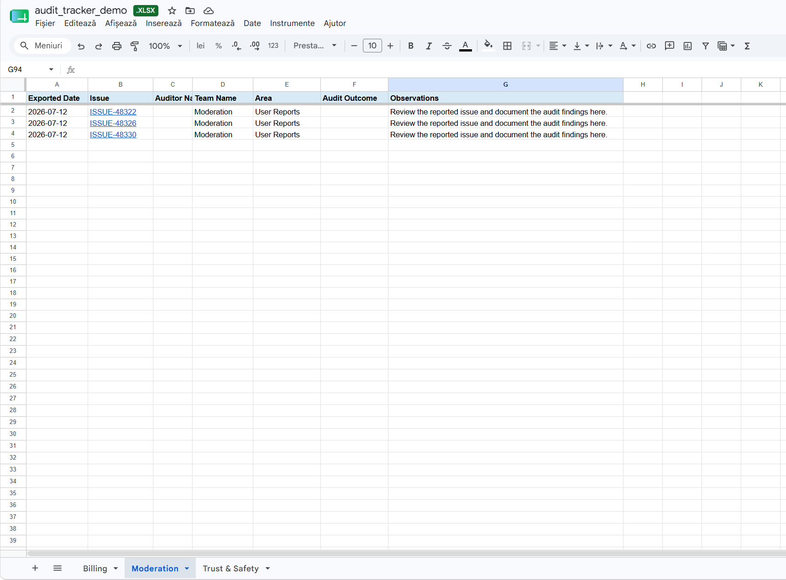
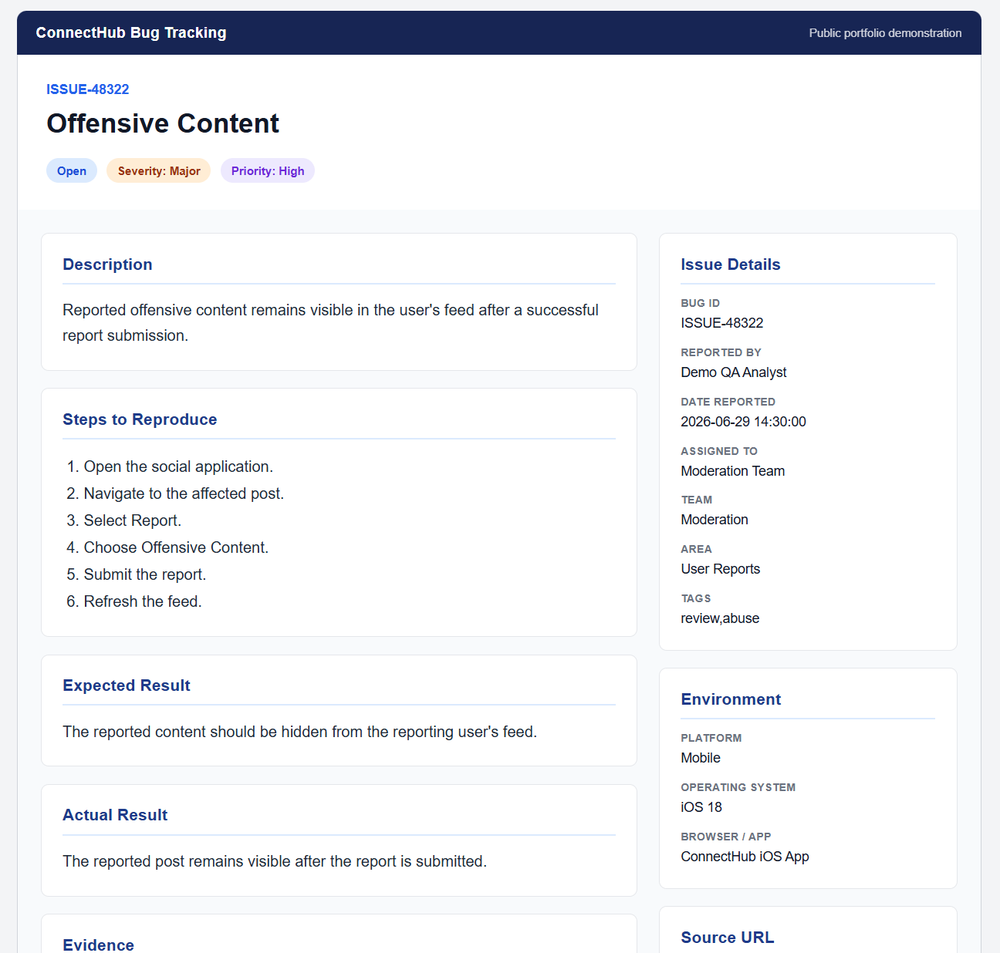
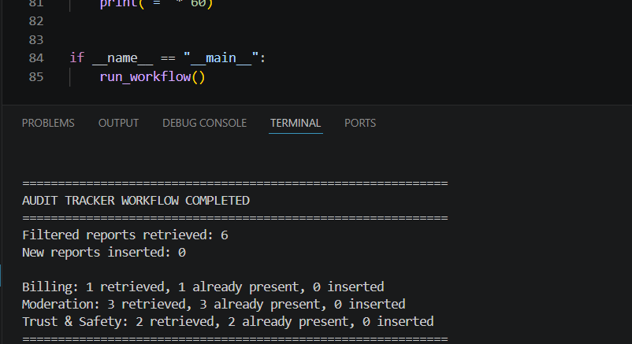

# Audit Tracker Workflow Automation

## Overview

This repository demonstrates a production-inspired Python automation that prepares weekly audit trackers by automatically extracting operational reports, applying business rules, routing reports to the correct audit team and updating a multi-sheet audit tracker.

The original solution was implemented as a scheduled Python notebook within an internal environment. This public version recreates the engineering workflow using SQLite, SQL, Pandas and Excel while excluding all proprietary systems, confidential data and internal business logic.

---

## Business Problem

The audit preparation process was previously performed manually every week.

The workflow required analysts to:

- Open the operational dashboard
- Apply business filters
- Review eligible issue reports
- Copy issue identifiers
- Paste reports into the correct audit tracker
- Repeat the process for each operational team
- Prevent duplicate audit entries manually

The process was repetitive, time-consuming and susceptible to copy-and-paste errors.

---

## Solution

The automation performs the complete workflow automatically.

### Workflow

1. Execute the scheduled workflow
2. Query the operational data source
3. Apply SQL business rules
4. Extract eligible issue reports
5. Group reports by operational team
6. Prepare tracker-ready datasets
7. Generate clickable issue links
8. Read existing tracker entries
9. Detect previously exported issues
10. Insert only new reports
11. Update the appropriate team worksheet
12. Produce an execution summary

---

## Workflow Architecture

.png)

---

# Manual vs Automated Process

.png)

---

## Repository Structure

```text
audit-tracker-workflow-automation/
│
├── demo/
│   ├── bug_reports/
│   │   ├── ISSUE-xxxxx.html
│   │   └── ...
│   │
│   ├── database/
│   │   ├── connecthub_demo.db
│   │   ├── create_database.py
│   │   └── generate_bug_reports.py
│   │
│   ├── output/
│   │   └── audit_tracker_demo.xlsx
│   │
│   ├── scheduler/
│   │   ├── notebook_schedule.json
│   │   └── schedule.md
│   │
│   ├── sql/
│   │   └── filter_reports.sql
│   │
│   └── src/
│       ├── deduplicate_reports.py
│       ├── excel_tracker.py
│       ├── extract_reports.py
│       ├── group_by_team.py
│       ├── load_reports.py
│       ├── prepare_tracker_data.py
│       ├── run_workflow.py
│       └── team_mapping.py
│
├── docs/
│   └── images/
│
├── requirements.txt
│
└── README.md
```

---

## Demo Workflow

```text
                 Scheduled Workflow
                        │
                        ▼
              SQLite Demo Database
                        │
                        ▼
              SQL Business Filtering
                        │
                        ▼
                 Extract Reports
                        │
                        ▼
                 Group by Team
                        │
                        ▼
            Prepare Tracker Dataset
                        │
                        ▼
            Open Audit Tracker Workbook
                        │
                        ▼
          Read Existing Tracker Entries
                        │
                        ▼
             Remove Duplicate Reports
                        │
                        ▼
            Generate Clickable Issue Links
                        │
                        ▼
         Update Team Worksheets in Excel
                        │
                        ▼
               Processing Summary
```

---

## Scheduling

In production, the workflow was configured using the notebook platform's built-in scheduler.

**Schedule**

- Frequency: Weekly
- Day: Monday
- Time: 12:00 PM
- Time Zone: Europe/Dublin

The SQL query retrieves reports created during the previous Monday–Sunday reporting period regardless of the execution date.

For this public demonstration, the workflow is executed manually:

```bash
python demo/src/run_workflow.py
```

---

## How to Run

### Clone the repository

```bash
git clone https://github.com/DiditaDeliaAndreea/audit-tracker-workflow-automation.git
cd audit-tracker-workflow-automation
```

### Install dependencies

```bash
pip install -r requirements.txt
```

### Create the demo database

```bash
python demo/database/create_database.py
```

### Generate sample issue reports

```bash
python demo/database/generate_bug_reports.py
```

### Execute the workflow

```bash
python demo/src/run_workflow.py
```

The workflow will:

- Extract eligible reports from the SQLite database.
- Apply SQL business rules.
- Prepare tracker-ready datasets.
- Prevent duplicate exports.
- Update the audit tracker workbook.
- Generate a processing summary.

---

## Technologies

- Python
- SQL
- SQLite
- Pandas
- OpenPyXL
- HTML
- VS Code

---

## Features

- SQL business rule filtering
- Dynamic weekly reporting period
- Team-based routing
- Multi-sheet audit tracker
- Automatic worksheet creation
- Clickable issue report pages
- Duplicate detection
- Incremental tracker updates
- Processing summary
- Modular architecture

---

## Project Architecture

The project follows a modular architecture where each module has a single responsibility.

| Module | Responsibility |
|---------|----------------|
| `create_database.py` | Creates and populates the SQLite database used to simulate the production data source. |
| `generate_bug_reports.py` | Generates fictional employee issue report pages linked from the audit tracker. |
| `filter_reports.sql` | Applies the SQL business rules used to identify reports eligible for auditing. |
| `load_reports.py` | Connects to SQLite, executes the supplied SQL query and returns the results as a Pandas DataFrame. |
| `extract_reports.py` | Reads the configured SQL query and coordinates report extraction. |
| `group_by_team.py` | Groups extracted reports by operational team. |
| `prepare_tracker_data.py` | Builds tracker-ready datasets by generating hyperlinks and populating the audit tracker columns. |
| `team_mapping.py` | Maps operational teams to their corresponding Excel worksheet. |
| `deduplicate_reports.py` | Prevents duplicate report exports by comparing extracted reports with existing tracker entries. |
| `excel_tracker.py` | Handles Excel workbook operations, including worksheet management, headers and row insertion. |
| `run_workflow.py` | Orchestrates the complete workflow from report extraction through tracker update and execution summary. |

---

## Issue Reports

Each exported issue contains a clickable hyperlink that opens a generated issue report.

The reports simulate operational issues submitted by employees through an internal reporting system.

Each report contains:

- Issue ID
- Title
- Description
- Environment
- Steps to Reproduce
- Expected Result
- Actual Result
- Severity
- Priority
- Supporting Evidence
- Source URL
- Reported By
- Assigned Team
- Status

---

## Results

Compared to the manual process, the automation:

- Eliminates repetitive copy-and-paste work.
- Applies consistent SQL business rules.
- Automatically routes reports to the correct team.
- Prevents duplicate exports.
- Produces tracker-ready worksheets.
- Generates clickable issue reports.
- Reduces preparation from a repetitive manual task to a single workflow execution.

---

## Skills Demonstrated

- Python Automation
- SQL Development
- Data Processing with Pandas
- Workflow Automation
- Process Improvement
- Excel Automation
- Data Validation
- Software Design
- Technical Documentation

---

## Screenshots

### Audit Tracker



### Issue Report



### Workflow Execution



---

## Disclaimer

This repository is a public engineering demonstration inspired by a production workflow.

All report titles, issue identifiers, employee reports, operational teams and business entities are fictional and created solely for demonstration purposes.

No proprietary code, confidential business logic or internal systems are included.
